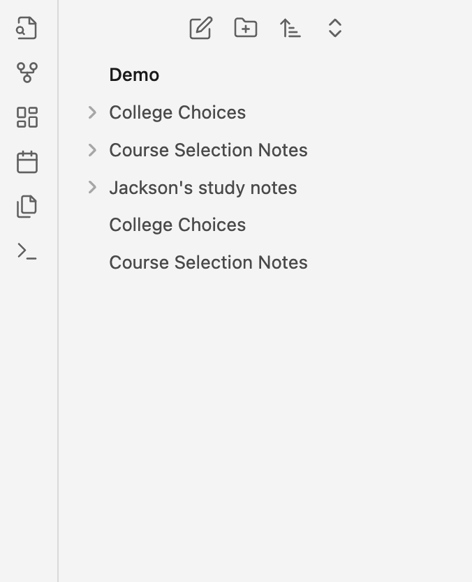
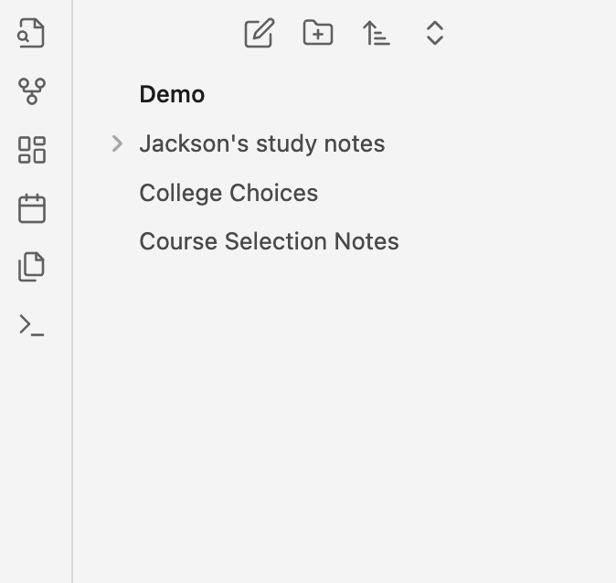

# SameNameDirHide Plugin for Obsidian

## Overview

The SameNameDirHide plugin is designed to improve the navigation experience in Obsidian by hiding directories that have the same name as the current file. This is particularly useful when your vault has numerous folders leading to a cluttered workspace, and you want to keep your notes more accessible, mimicking the behavior seen in Typora.

Before :

After:

This plugin should be used in conjunction with the [Custom Attachment Name plugin](https://github.com/RainCat1998/obsidian-custom-attachment-location), which ensures that folder names match the corresponding file names. With SameNameDirHide, you can seamlessly hide same-name folders in the left sidebar, keeping your workspace organized and focused on your content.

## Features

- **Automatic Folder Hiding**: Hide folders with the same name as the current file to declutter the workspace sidebar.
- **Settings Tab**: Toggle the plugin's features on or off and configure display preferences.
- **Status Bar Indication**: Quickly view the hiding status directly in Obsidian's status bar.

## Usage

Open Box Use 📦 Just Download it and put it into your plugins directory

## Contributing

Your contributions are welcome! If you'd like to improve the SameNameDirHide plugin, please consider submitting a pull request or opening an issue on our [GitHub repository](https://github.com/your-github-username/SameNameDirHide).

## License

SameNameDirHide is released under the MIT License.
